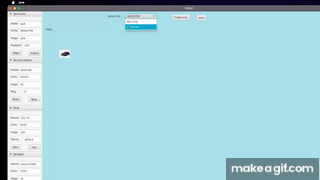

# CarThread
This Java multi-threading project showcases an application where clicking on a specific area causes a car to move to that location. As you change the view of the car, the original car continues its movement, indicating that it is running in a separate thread. This demonstrates the application of multi-threading to simulate parallel tasks within the program, allowing the car’s movement to be independent of the view updates.

